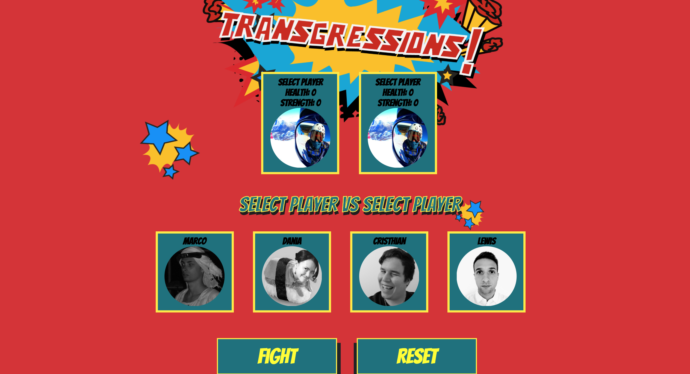

# Transgressions Battle - Client

[Task](#task) | [Approach](#approach) | [Challenges](#challenges) | [Run the App](#run) | [Technologies](#technologies) | [Team](#team)

This is a battle game built using Ruby on Rails and React JS. Two players can play. Once the application is started each player can select a player and then choose to battle! All player information is stored in a postgreSQL database which is then served as a Rails API.

Note: This is the client side of the project. The back-end repo is [here](https://github.com/LewisYoul/transgression-battle-api). Both of these repositories will be required for the app to run successfully.

## <a name="task">Task</a>

This application is the product of the first unguided group project in week 9 of Makers Academy. After some discussion we decided that we wanted to build a game that utilised the full stack. For this project we also chose to use a brand new technology (to us) - React JS. The database is handled with PostgreSQL, it is served via a Rails API and the front end UI/UX is constructed using React JS.

## <a name="approach">Approach</a>

We wanted to use this project as an opportunity to consolidate the knowledge we had gained over the first two months at Makers Academy. It was seen as an opportunity to build a Ruby on Rails API from scratch using PostgreSQL and then use the data served from it in a dynamic way using React. This allowed us to practice using the Rails infrastructure and the MVC pattern.

It also afforded us an opportunity to try out a brand new technology. We chose to use React JS because it is gaining in popularity and the flexibility it offers to DOM manipulation is exciting. By using a back-end technology we were relatively familiar with it allowed us to spend time learning and understanding this new paradigm.

It was vital for us to create an MVP - We concluded that the following three user stories would result in our MVP being complete.

```
As a user,
So I can be engaged with the battle game,
I would like to see two characters on the screen
```

```
As a user,
So I can deal damage,
I would like to attack a player
```

```
As a user,
So I can receive damage,
I would like the attacked player to lose some health  
```

Following the completion of the MVP we used stand ups and retros to discuss the further user stories that should be implemented for our application to meet the users needs. For the sake of brevity, they have been shortened to one line each below:

```
- I would like to be able to select a player
- I would like to select another player
- I would like to see the details of the player I have selected
- I would like to have more than one attack on the battle page.
- I would like to see the changed hp on the screen.
- I would like to see a GameOver Page.
- I would like to be redirected to the character page again!
- I would like to see some effect when I attack a player.
- I would like to have background music whilst playing the game.
```

## <a name="run">Run the App</a>

The following covers the necessary steps for starting up the client-side React JS application for the Transgressions Battle game. Before setting this up should ensure that you have followed the steps for the back-end server [here](https://github.com/LewisYoul/transgression-battle-api).

1. Clone this repository
```
git clone https://github.com/LewisYoul/pokebattle-react
```

2.  Navigate into the project directory
```
cd pokebattle
```

3. Install all required dependencies using:
```
npm install
```

4. Start the React App
```
npm start
```
5. In order to allow communication between two local servers you may need to add [this](https://chrome.google.com/webstore/detail/cors-toggle/jioikioepegflmdnbocfhgmpmopmjkim?hl=en) plugin to chrome. It will allow your requests to have the correct headers.
Also ensure that you are running the Rails server on port 4000!



## <a name="challenges">Challenges</a>

* Learning a new language! While React JS is written in JavaScript it offers a very different way of thinking about how HTML elements are rendered to the page. Learning this all in one week as well as building a working product was certainly challenging.
* Testing React! This is a challenge we eventually overcame through the use of the Jest testing framework. If I had more time on this project I would love to spend more time understanding how to efficiently test React.

## <a name="technologies">Technologies</a>

JavaScript & React JS with Jest testing library

## <a name="team">Team</a>

- 🐿 Cristhian Da Silva (https://github.com/cristhiandas)
- 🐱 Dania Mah (https://github.com/thatdania)
- 🐸 Lewis Youl (https://github.com/LewisYoul)
- 🐈 Marco Vanali (https://github.com/Vanals)
- 🐻 Oleg Grushetskyy (https://github.com/olegfkl)
- 🦅 Tabish Raza (https://github.com/tabrza)
